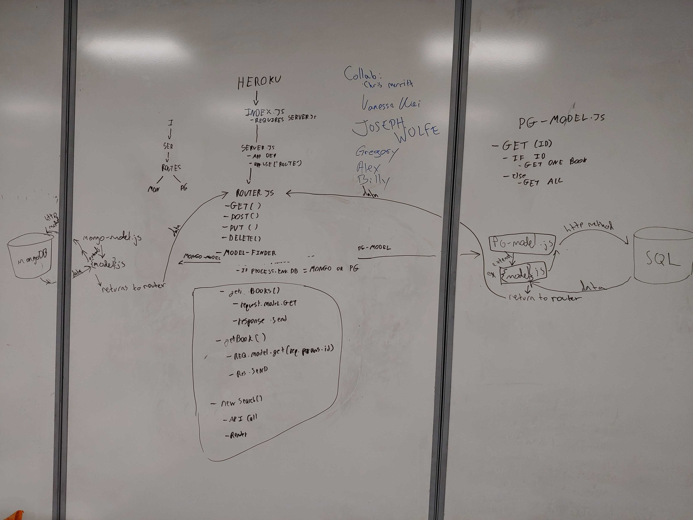

 LAB
=================================================

## Book App

### Chris Merritt

-Thanks to Joseph Wolfe, Billy Bunn, Alex White, and Vanessa Wei for contributing.

### Links and Resources
* [repo]()

Mongo backend:
* [mongo-back-end](https://merritt-bookapp-mongo.herokuapp.com/) 

PQSL backend:
* [psql-back-end](https://merritt-bookapp-psql.herokuapp.com/)

#### Documentation
* [swagger](https://merritt-bookapp-mongo.herokuapp.com/api/doc) 
* [jsdoc](https://merritt-bookapp-mongo.herokuapp.com/docs)

### Modules

#### Mongo:
* MongoModel class. Consists of the mongo schema and the methods get(), post(), put(), and delete().
  * get(id):
    Takes in an id as a parameter, but if there isnt one, it returns all values. Otherwise, returns only the values of that one id from the mongo database.
  * post(record):
    Takes in a record as a parameter then inserts that record into the mongo database.
  * put(id, record):
    Takes in an id and a record as a parameter. Replaces the values at the id in the mongo database with the record.
  * delete(id):
    Takes in an id as a parameter, then deletes all values at the id from the mongo database.

* book-model.js:
  * Extends the MongoModel class.

* book-schema.js:
  * defines the data schema for the book model that extends the MongoModel class.
  * has a 'pre' hook that populates the virtual columns with the bokoshelf values.

* bookshelves.js:
  * bookshelf contructor that extends the MongoModel.

* bookshelf-schema.js:
  * contains the virtual column for the books value within the bookshelf.

#### PSQL:
* pgmodels.js:

  * The postgres model class. Consists of the constructor and the methods get, post, put, delete.
  * get(id):
    If there is an id, it queries the sql database with that id and returns the values at the id. Otherwise, it returns all values from the database.

  * post(body, id):
    Takes the request body and an id as args. Creates a post to the SQL database, then inserts the new values where the bookshelf id is equal to the one provided.

  * put(request):
    Inserts the request into the sql database where the id is the one that is part of the request argument.

  * delete(id):
    Deletes the values from the SQL database where the id is the given value.

* book-model.js:
  Extends the Postgres model. Has the method createShelf(shelf).

  * createShelf(shelf):
    When the user posts a new value to the database, this function first checks if a value exists at the shelf, then either makes a new one or returns that value.

#### Other modules:
* index.js:
  The entry point to the site. Tells the server which database to start according to the 'DATABASE' value in the .env folder. Then starts the server.
  
* server.js:
  This is where the middleware is called, such as apiRoutes, routes, notFound, errorHandler. Exports the function to start the server so it can be started from index.js/

* Middleware:
  * 404.js:
    If the server hits a route that doesn't exist, return 404.

  * 500.js:
    If the server encounters an error, return 500.
  
  * model-finder.js:
    Tells the server which data model to create for the upcoming request (PSQL or Mongo).

* Route handling:
  * api-routes.js:
    Handles all calls to and from the google books api. has the constructor function for the Book object.
  
  * routes.js:
    Tells the server to use the model-finder middleware on each of the api calls here. Calls the main functions of: handleGetAll, handleGetOne, handleCreate, handleUpdate, handleDelete.

  * handleGetAll:
    Exports a function that calls the data model then recieves all data from the database. Then sends it to the front end.

  * handleGetOne:
    Exports a function that calls the model with a specific id then returns all data from that id. Sends the data to the front end.

  * handleCreate:
    First creates a new shelf for postgres database. Then calls the post method of the data model.

  * handleUpdate:
    Calls the data model at a specific id, then sends the changes to make. Redirects the front end to the next page.

  * handleDelete:
    Calls the data model with a delete function that then removes that value from the data base. Redirects the front end back to the home page.

### Setup

#### `.env` requirements
* `PORT` - 8080
* `MONGODB_URI` - mongodb://localhost:27017/stuff
* `DATABASE_URL` - postgres connections string. DB name: book_app.
* `DATABASE` - either 'pg' to use postgres database or 'mongo' to use mongodb.

#### Running the app
* `npm start`

#### UML

